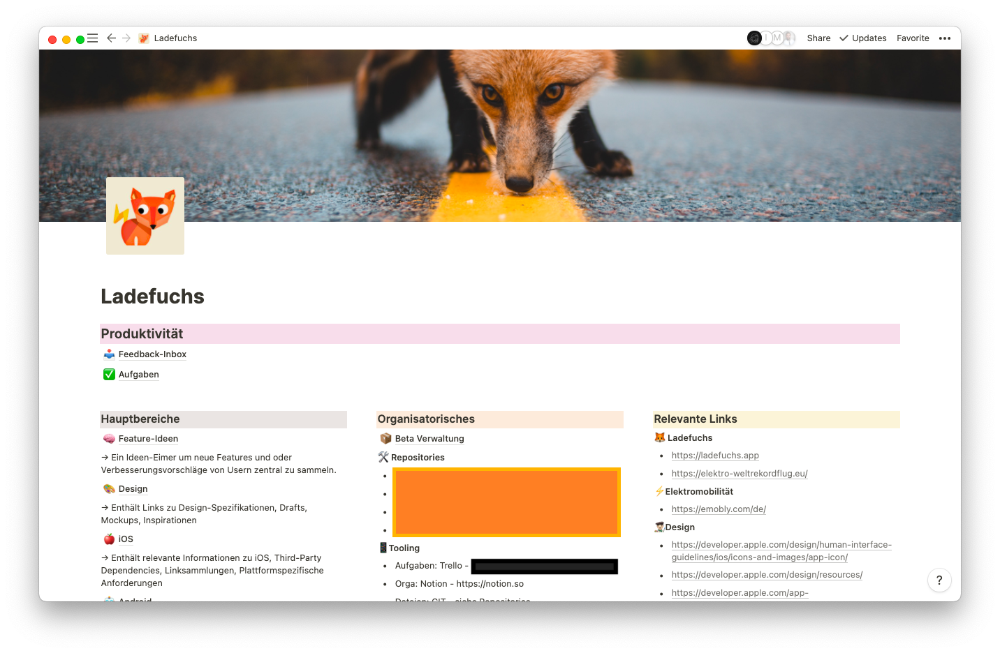

Notion ist ein wundervolles Tool, und wer es noch nicht kennt sollte unbedingt einen Blick darauf werfen. Es ist derart vielfältig,
dass sich damit die meisten Anwendungsfälle abbilden lassen, sei es Organisation eines Podcasts, einer App, einer Firma, eines selbständigen Unternehmens, einer Familie oder dem hiesigen Badminton-Verein.

Viele Menschen nutzen Notion auch als Taskmanager, sei es nun mit einfach Checklisten, als Kanban-Board oder über die immer beliebter werdenden Aufgabenkalender -- Notions dynamische Ansichten ("Views") der Dateneinträge ("Databases") machen ein individuelles Auffinden und Bearbeiten von Aufgaben schnell und effizient.

Es liegt also nahe, Notion direkt als TaskManager einzubinden.

Das Problem?

**Kein Offline-Support.** Notion speichert zwar die Inhalte zwischen, aber es kommt trotz größten Bemühungen immer wieder zu Fehlern in der Synchronisierung. Und wer seine Todo-Liste als "Single Source of Truth" nutzt der weiß, wie es sich anfühlt, wenn diese Liste mal nicht griffbereit ist.

Würde Notion funktionierenden, guten Offline-Support einführen (wie zB. die Alternative [Craft](https://craft.do)) wäre es dem Traum 
einer all umfassenden Produktivitätssuite ein Stück näher.

Fingers crossed 🤞🏻